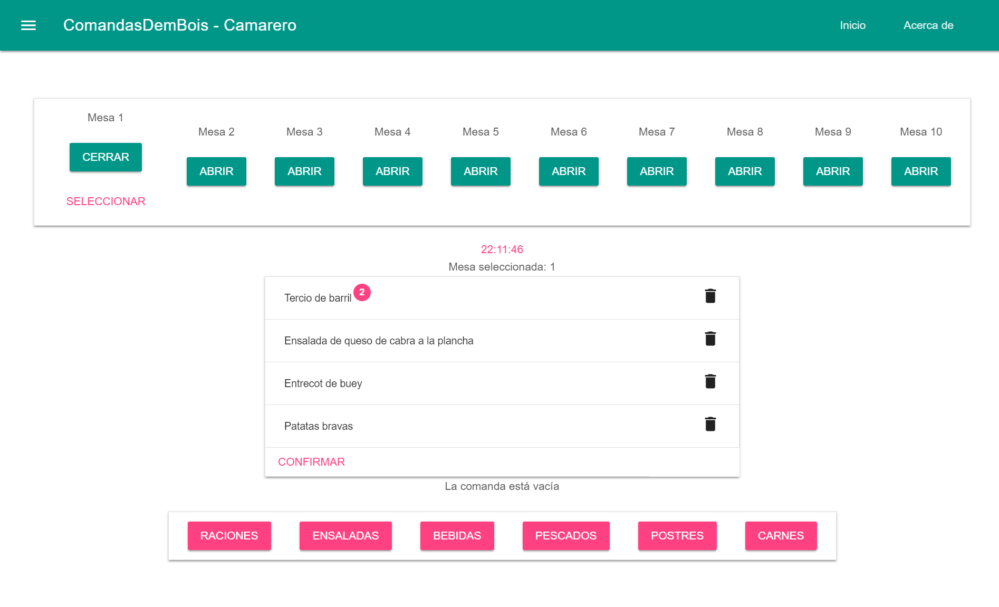
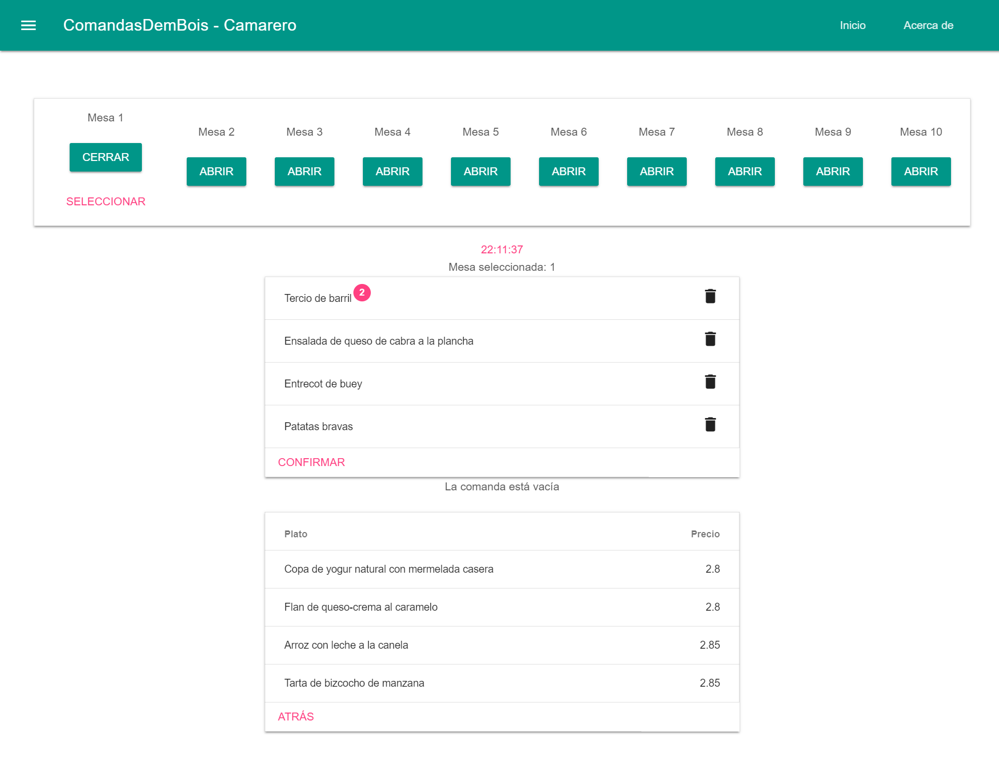
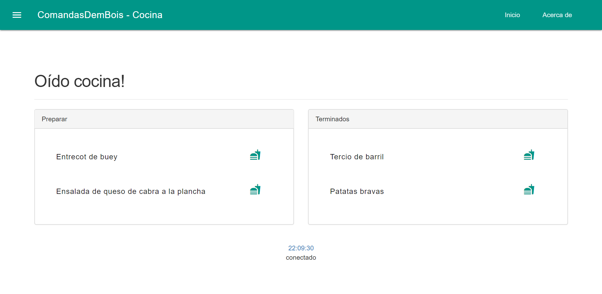

# telecomandas
software design lab project
> restaurant services multiplatform app - [uclm](https://www.uclm.es/) computer science  
[requirements file](enunciado.pdf) given by the teacher  
  
>some screenshots running the web app 
  
  

