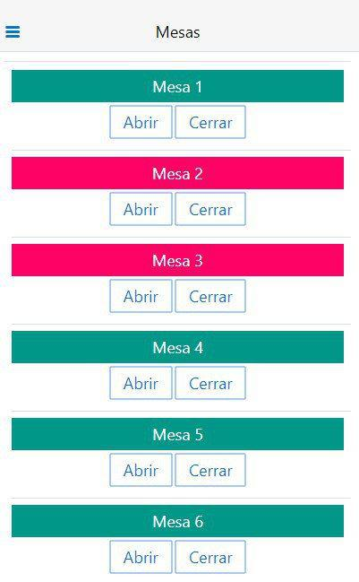
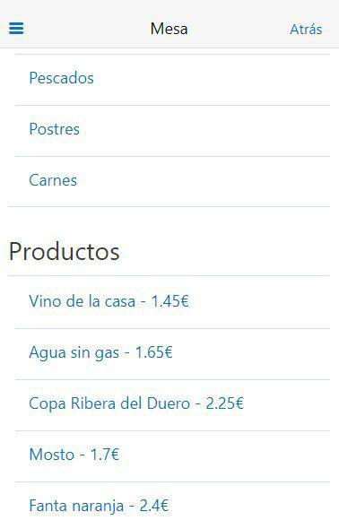

# telecomandas
[![uclm](https://img.shields.io/badge/uclm-project-red.svg?logo=data:image/png;base64,iVBORw0KGgoAAAANSUhEUgAAAA8AAAAPCAYAAAA71pVKAAAC9UlEQVR42o3S3UtTYRwH8F//QhBE3WT0elGr6CZUCLzoRUQt6ibICrESS1MDi7pJwcSXgsCGlG+1LFFzzpzONqduTp3TqVO36V7OzubZ2TznbDvn7NW5nmlXWdADPzg8/D6c3/N9HohSDPCrDgg53bDJByERj0OEpCCEE8cjXlrJaBbOcys2iHpp1OOBgN4MaG/b/BXHfKxgkwuaNvkQE6X8WNDiTI16qP/AicTlMElPeeXTtdTY7G1Kpa/iLU5dnONvhHDyH9hBJGEGu2RV2t93PWaXrb2xAO/kTJgMb5EUM9MGWZQJ5PrnTH9gMwYx2n865PLOrr5uK+XXcLV/YfUD3t5fFFgwN0Y89JzlTUcxb3PNc2YsjVHrdzAKBX1gh+KhsIXokgtJqbopxvIvEa7y600i38xSnXd4qpwa1zcTvcqGqNdHMBPzpzijHSDGcic2WV4Xj0QTGwptBd4meejTGb+gKcS+acMD1mj7Ro3OfcWE3fddnbJnKMRExMuYglbXWUCjjCTQitEBu2dQU05rFp6gsOrJftXzqI9d8gxpajzDk9XUqK6MVs+Xx9igLtnPmewz4GiRnEFprmxtbSXWO4crUCgVrs7hfDTyeLIpiBG29a6fBTxGlPkX116grQBrwnBHq+QCOD9LwflpQIDSNVAjM8IQSVWQfWN1lgZRQRLjH8WF7h5FJW9brww63I2c2WG0N/WkOUVSAHJADZ6BCXAIu/eiP9ehs79Do97xzxrbk5hdsYo9UlVejAnU0lOGFnvT932ubsW2A01WMUxml8Bo2l3QZD7ai+6wnLc5XyGnSuyslTC5UYOOUTJz/enBifR80GaXgjanDGAoJRMGU67Cj/0ZMJZ+DyzVrYdplT4PocXf2B4wWIrwVslJzcUCkB+4AiNHc1HlAMgFN7dr6EgWqC8VgrVeBI7mPkBPUZuUYfeGlehR7HGhbKYzi0F57BqMn7uVrN3Y9rYD0HMEontE4NMuK7yyyVS3WAmujqFd+Bcdh3NlWlsAggAAAABJRU5ErkJggg==&longCache=true&colorA=b30135&colorB=555555&style=for-the-badge)](https://www.uclm.es)  
software design lab project
> restaurant services multiplatform app - [uclm](https://www.uclm.es/) computer science  
[requirements file](enunciado.pdf) given by the teacher  
  
some screenshots running the web app  
waiter client
  
  
kitchen client
  
mobile client (android & iOS)

